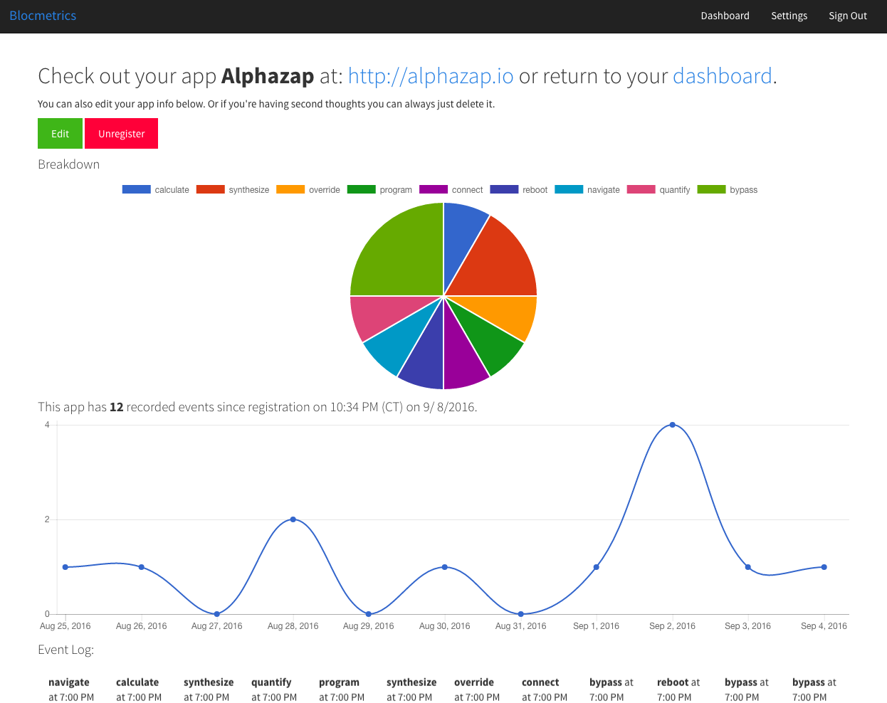

# Blocmetrics




== README

Add this snippet to your app.js file to track events through Blocmetrics

```JavaScript
  var blocmetrics = {};
  blocmetrics.report = function(eventName){
   var event = {event: { name: eventName }};

   var request = new XMLHttpRequest();
   request.open("POST", "http://localhost:3000/api/events", true);
   request.setRequestHeader('Content-Type', 'application/json');
   request.send(JSON.stringify(event));
  };
```

This README would normally document whatever steps are necessary to get the
application up and running.

Things you may want to cover:

* Ruby version

* System dependencies

* Configuration

* Database creation

* Database initialization

* How to run the test suite

* Services (job queues, cache servers, search engines, etc.)

* Deployment instructions

* ...


Please feel free to use a different markup language if you do not plan to run
<tt>rake doc:app</tt>.
